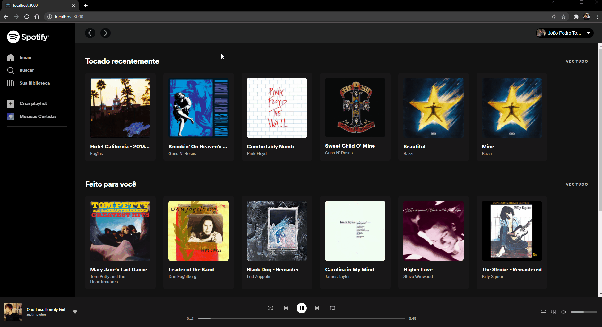

<h1 style="text-align: center;"> Spotify clone</h1>

Recration of official Spotify UI 

    <a href="#about">About</a> ∙
    <a href="#built-with">Built With</a> ∙
    <a href="#features">Features</a> ∙

<h1>About</h1>

Reacreating Spotify UI with React JS and consuming its API

Click on the image down below to see the full project working

  <h1>Built With</h1>

- React JS;
- CSS;
- Axios;
- React Router;

<h1>Features</h1>

<h2>Player</h2>

Spotify player, with all controls.

<h2>To see all the functionalities click on the button down below</h2>

<a href="https://youtu.be/MdgzTv1W8G0">Click here</a>
