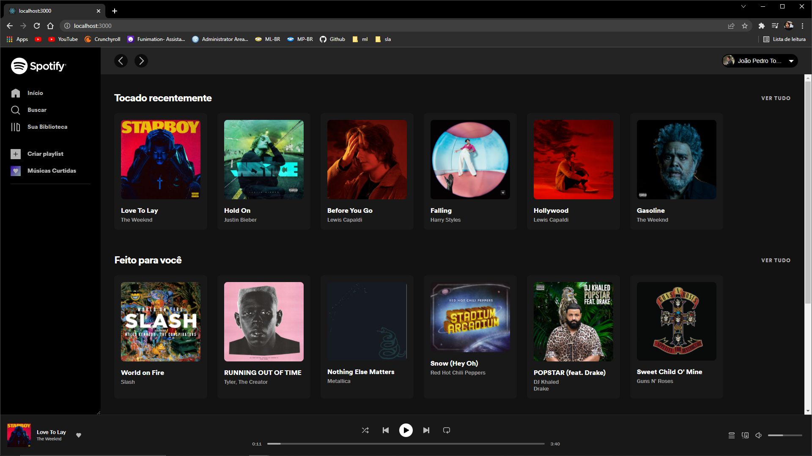

<h1 style="text-align: center;"> Spotify clone</h1>
<h2 style="text-align: center;">🚧 work in progress 🚧</h2>

Recration of official Spotify UI 

    <a href="#about">About</a> ∙
    <a href="#built-with">Built With</a> ∙
    <a href="#features">Features</a> ∙

<h1>About</h1>
Reacreating Spotify UI with React JS and consuming its API

  <h1>Built With</h1>

- React JS;
- CSS;
- Axios;
- React Router;

<h1>Features</h1>

<h2>Player</h2>

spotify player, with all controls.

<video src="src/assets/images/homepage.mp4" controls style="height:350px">

<h1 style="text-align: center;">🚧 work in progress 🚧</h1>
<h2 style="text-align: center;">this is'ant the done ptoject</h2>
